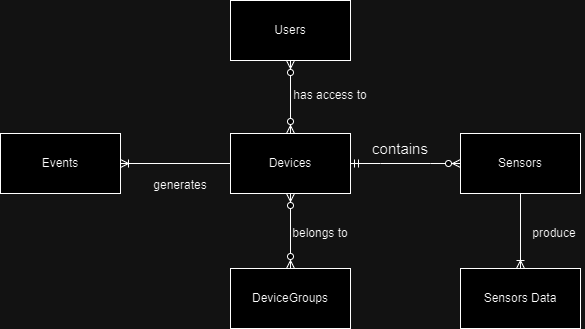
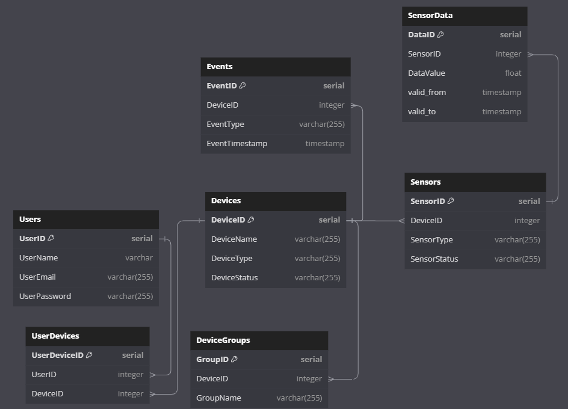

# Проект: База данных IoT устройств

## 1. Тема

В рамках этого проекта мы будем проектировать базу данных, для IoT устройств. Планирутеся следующий функционал:
- **Сбор и хранение данных**: IoT устройства собирают данные с датчиков и отправляют их в базу данных для последующего анализа и обработки.
- **Обработка и анализ данных**: Собранные данные обрабатываются для получения полезной информации, включая вычисление статистических показателей, обнаружение аномалий и прогнозирование будущих значений.
- **Мониторинг состояния устройств**: База данных хранит информацию о состоянии каждого IoT устройства, позволяя операторам системы мониторить состояние устройств и быстро реагировать на любые проблемы.
- **Управление доступом**: База данных хранит информацию о пользователях и их правах доступа к IoT устройствам и данным, обеспечивая контроль над тем, кто может просматривать и изменять данные и настройки устройств.
- **Генерация отчетов**: Данные в базе данных используются для генерации отчетов о работе IoT системы, включая отчеты о состоянии устройств, отчеты об использовании ресурсов и отчеты об обнаруженных аномалиях.
## 2. Концептуальная модель

Kонцептуальная модель включает следующие значащие таблицы и связи между ними:

- **Устройства (Devices)**: Хранит информацию о каждом IoT устройстве.
- **Датчики (Sensors)**: Хранит информацию о датчиках устройств.
- **Данные с датчиков (SensorData)**: Хранит данные, собранные с датчиков на IoT устройствах.
- **События (Events)**: Хранит информацию о событиях или ошибках, которые происходят на IoT устройствах.
- **Пользователи (Users)**: Хранит информацию о пользователях, которые имеют доступ к IoT устройствам.
- **Группы датчиков (DeviceGroups)**: Хранит информацию о группах датчиков, отвечающих за функционал локации




## 3. Логическая модель


**Нормальная форма**\
Т.к. устройства генерируют много однотипных записей, оптимальным решением будет свести таблицы к 3NF.
Третья нормальная форма (3NF): Все неключевые атрибуты в ваших таблицах нетранзитивно функционально зависят от первичного ключа. Нет атрибутов, которые зависят от других неключевых атрибутов.

**Версионирование**\
В таблицах будем использовать тип SCD 2, потому что:
1. Необходима полная история изменений
2. Удобный и простой доступ к данным необходимого периода


## 4. Физическая модель


**UserDevices**

| Name | Description | Data Type | Limitation |
| --- | --- | --- | --- |
| UserDeviceID | User device identifier | integer | PRIMARY KEY |
| UserID | User identifier | integer | FOREIGN KEY, NOT NULL |
| DeviceID | Device identifier | integer | FOREIGN KEY, NOT NULL |

**DeviceGroups**

| Name | Description | Data Type | Limitation |
| --- | --- | --- | --- |
| GroupID | Group identifier | integer | PRIMARY KEY |
| DeviceID | Device identifier | integer | FOREIGN KEY, NOT NULL |
| GroupName | Group name | varchar(255) | NOT NULL |


**Sensors**

| Name | Description | Data Type | Limitation |
| --- | --- | --- | --- |
| SensorID | Sensor identifier | integer | PRIMARY KEY |
| SensorType | Sensor type | varchar(255) | NOT NULL |
| SensorStatus | Sensor status | varchar(255) | NOT NULL |
| DeviceID | Device identifier | integer | FOREIGN KEY  |

**SensorData**

| Name | Description | Data Type | Limitation |
| --- | --- | --- | --- |
| DataID | Data identifier | integer | PRIMARY KEY |
| SensorID | Sensor identifier | integer | FOREIGN KEY, NOT NULL |
| DataValue | Data value | float | NOT NULL |
| valid_from | Valid from timestamp | timestamp | NOT NULL |
| valid_to | Valid to timestamp | timestamp | NOT NULL |

**Users**

| Name | Description | Data Type | Limitation |
| --- | --- | --- | --- |
| UserID | User identifier | integer | PRIMARY KEY |
| UserName | User name | varchar(255) | NOT NULL |
| UserEmail | User email | varchar(255) | NOT NULL |
| UserPassword | User password | varchar(255) | NOT NULL |

**Events**

| Name | Description | Data Type | Limitation |
| --- | --- | --- | --- |
| EventID | Event identifier | integer | PRIMARY KEY |
| DeviceID | Device identifier | integer | FOREIGN KEY, NOT NULL |
| EventType | Event type | varchar(255) | NOT NULL |
| EventTimestamp | Event timestamp | timestamp | NOT NULL |

**Devices**

| Name | Description | Data Type | Limitation |
| --- | --- | --- | --- |
| DeviceID | Device identifier | integer | PRIMARY KEY |
| DeviceName | Device name | varchar(255) | NOT NULL |
| DeviceType | Device type | varchar(255) | NOT NULL |
| DeviceStatus | Device status | varchar(255) | NOT NULL |

**DeviceSensors**

| Name | Description | Data Type | Limitation |
| --- | --- | --- | --- |
| DeviceSensorID | Device sensor identifier | integer | PRIMARY KEY |
| DeviceID | Device identifier | integer | FOREIGN KEY, NOT NULL |
| SensorID | Sensor identifier | integer | FOREIGN KEY, NOT NULL |

## 5. Реализация схемы посредством DDL-скриптов

Пример создания схемы и таблицы Devices
```
CREATE SCHEMA IF NOT EXISTS project;

CREATE TABLE project.Devices (
  DeviceID SERIAL PRIMARY KEY,
  DeviceName VARCHAR(255) NOT NULL,
  DeviceType VARCHAR(255) NOT NULL,
  DeviceStatus VARCHAR(255) NOT NULL
);
```
**Full script:** [DDL.sql](./insertion/DDL.sql)

## 6. Заполнение схемы данными

| Tables | SQL Scripts | CSV Files |
| --- | --- | --- |
| **Devices** | [Devices.sql](./insertion/Devices.sql) | |
| **Users** | [Users.sql](./insertion/Users.sql) | |
| **Sensors** | [Sensors.py](./insertion/Sensors.py) | [Sensors.csv](./insertion/Sensors.csv) |
| **Events** | [Events.sql](./insertion/Events.sql) | |
| **DeviceGroups** | [DeviceGroups.sql](./insertion/DeviceGroups.sql) | |
| **SensorData** | [SensorData.sql](./insertion/SensorData.sql) | |
| **UserDevices** | [UserDevices.py](./insertion/UserDevices.py) | [UserDevices.csv](./insertion/UserDevices.csv) |

## 7. Написание 10 осмысленных запросов

| Number |  Description | Script |
| --- | --- | --- |
| 1 | Получить всех пользователей, у которых есть устройство определенного типа | [1.sql](queries/1.sql) |
| 2 | Получить среднее значение данных для каждого типа датчика | [2.sql](queries/2.sql) |
| 3 | Получить количество устройств в каждой группе устройств | [3.sql](queries/3.sql) |
| 4 | Получить самое последнее событие для каждого устройства | [4.sql](queries/4.sql) |
| 5 | Получить устройства, у которых больше определенного количества датчиков | [5.sql](queries/5.sql) |
| 6 | Получить пользователей, у которых есть устройство с определенным датчиком | [6.sql](queries/6.sql) |
| 7 | Получить устройства, которые никогда не имели событий | [7.sql](queries/7.sql) |
| 8 | Получить датчик с наибольшим средним значением данных | [8.sql](queries/8.sql) |
| 9 | Получить количество устройств у каждого пользователя | [9.sql](queries/9.sql) |
| 10 | Получить датчик, у которого больше всего записей данных | [10.sql](queries/10.sql) |