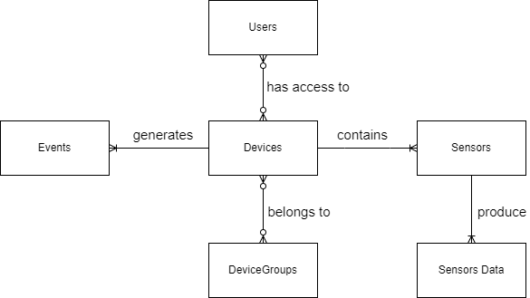
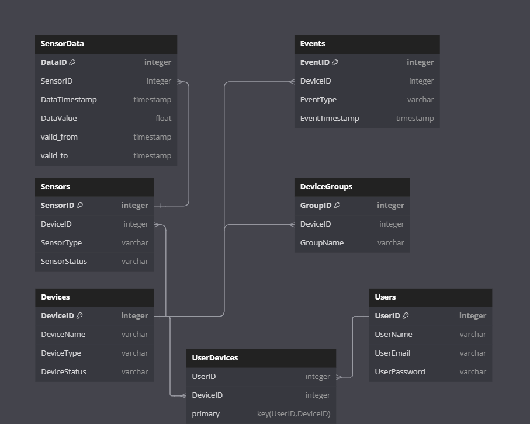

# Проект: База данных IoT устройств

## 1. Тема

В рамках этого проекта мы будем проектировать базу данных, для IoT устройств. Планирутеся следующий функционал:
- **Сбор и хранение данных**: IoT устройства собирают данные с датчиков и отправляют их в базу данных для последующего анализа и обработки.
- **Обработка и анализ данных**: Собранные данные обрабатываются для получения полезной информации, включая вычисление статистических показателей, обнаружение аномалий и прогнозирование будущих значений.
- **Мониторинг состояния устройств**: База данных хранит информацию о состоянии каждого IoT устройства, позволяя операторам системы мониторить состояние устройств и быстро реагировать на любые проблемы.
- **Управление доступом**: База данных хранит информацию о пользователях и их правах доступа к IoT устройствам и данным, обеспечивая контроль над тем, кто может просматривать и изменять данные и настройки устройств.
- **Генерация отчетов**: Данные в базе данных используются для генерации отчетов о работе IoT системы, включая отчеты о состоянии устройств, отчеты об использовании ресурсов и отчеты об обнаруженных аномалиях.
## 2. Концептуальная модель

Наша концептуальная модель включает следующие значащие таблицы и связи между ними:

- **Устройства (Devices)**: Хранит информацию о каждом IoT устройстве.
- **Датчики (Sensors)**: Хранит информацию о датчиках устройств.
- **Данные с датчиков (SensorData)**: Хранит данные, собранные с датчиков на IoT устройствах. Связана с таблицей Устройства по полю DeviceID.
- **События (Events)**: Хранит информацию о событиях или ошибках, которые происходят на IoT устройствах. Связана с таблицей Устройства по полю DeviceID.
- **Пользователи (Users)**: Хранит информацию о пользователях, которые имеют доступ к IoT устройствам.
- **Устройства пользователя (UserDevices)**: Отслеживает, какие устройства принадлежат или управляются каждым пользователем. Связана с таблицей Устройства по полю DeviceID и с таблицей Пользователи по полю UserID.
- **Группы датчиков (DeviceGroups)**: Хранит информацию о группах датчиков, отвечающих за функционал локации

## 3. Логическая модель

**Нормальная форма**\
Т.к. устройства генерируют много однотипных записей, оптимальным решением будет свести таблицы к 3NF.
Третья нормальная форма (3NF): Все неключевые атрибуты в ваших таблицах нетранзитивно функционально зависят от первичного ключа. Нет атрибутов, которые зависят от других неключевых атрибутов.

**Версионирование**\
В таблицах будем использовать тип SCD 2, потому что:
1. Необходима полная история изменений
2. Удобный и простой доступ к данным необходимого периода

## 4. Физическая модель

**Devices**

| Name | Description | Data Type | Limitation |
| --- | --- | --- | --- |
| DeviceID | Идентификатор устройства | integer | PRIMARY KEY |
| DeviceName | Название устройства | varchar(255) | NOT NULL |
| DeviceType | Тип устройства | varchar(255) | NOT NULL |
| DeviceStatus | Статус устройства | varchar(255) | NOT NULL |

**Sensors**

| Name | Description | Data Type | Limitation |
| --- | --- | --- | --- |
| SensorID | Идентификатор датчика | integer | PRIMARY KEY |
| DeviceID | Идентификатор устройства | integer | FOREIGN KEY REFERENCES Devices(DeviceID) |
| SensorType | Тип датчика | varchar(255) | NOT NULL |
| SensorStatus | Статус датчика | varchar(255) | NOT NULL |

**Events**

| Name | Description | Data Type | Limitation |
| --- | --- | --- | --- |
| EventID | Идентификатор события | integer | PRIMARY KEY |
| DeviceID | Идентификатор устройства | integer | FOREIGN KEY REFERENCES Devices(DeviceID) |
| EventType | Тип события | varchar(255) | NOT NULL |
| EventTimestamp | Время события | timestamp | NOT NULL |

**Users**

| Name | Description | Data Type | Limitation |
| --- | --- | --- | --- |
| UserID | Идентификатор пользователя | integer | PRIMARY KEY |
| UserName | Имя пользователя | varchar(255) | NOT NULL |
| UserEmail | Электронная почта пользователя | varchar(255) | NOT NULL |
| UserPassword | Пароль пользователя | varchar(255) | NOT NULL |

**SensorData**

| Name | Description | Data Type | Limitation |
| --- | --- | --- | --- |
| DataID | Идентификатор данных | integer | PRIMARY KEY |
| SensorID | Идентификатор датчика | integer | FOREIGN KEY REFERENCES Sensors(SensorID) |
| DataTimestamp | Время данных | timestamp | NOT NULL |
| DataValue | Значение данных | float | NOT NULL |
| valid_from | Время начала действия данных | timestamp | NOT NULL |
| valid_to | Время окончания действия данных | timestamp | NOT NULL |

**DeviceGroups**

| Name | Description | Data Type | Limitation |
| --- | --- | --- | --- |
| GroupID | Идентификатор группы | integer | PRIMARY KEY |
| DeviceID | Идентификатор устройства | integer | FOREIGN KEY REFERENCES Devices(DeviceID) |
| GroupName | Название группы | varchar(255) | NOT NULL |

**UserDevices**

| Name | Description | Data Type | Limitation |
| --- | --- | --- | --- |
| UserID | Идентификатор пользователя | integer | FOREIGN KEY REFERENCES Users(UserID) |
| DeviceID | Идентификатор устройства | integer | FOREIGN KEY REFERENCES Devices(DeviceID) |
| - | - | - | PRIMARY KEY (UserID, DeviceID) |